# CMEMS INSTAC

Ocean circulation models need information on the interior of the ocean to be able to generate accurate forecast. This information is only available from in-situ measurements. However this information is acquired by different institutes and not always easily accessible to operational users. Therefore, In Situ Thematic Assembly Centre ([INS-TAC](http://insitutac.coriolis.eu.org/Access-data)), by connecting to a lot of regional and international networks, collects, controls and disseminates the relevant in-situ data to operational users and research community. 
 
 

In Situ data, along with any other Copernicus Marine Enviroment Monitoring (CMEMS) such as satellite and modelling products, can be downloaded via Web User Interface after [registration](http://marine.copernicus.eu/services-portfolio/register-now/) at [CMEMS product catalogue](http://marine.copernicus.eu/)). See [how to](http://marine.copernicus.eu/services-portfolio/technical-faq/).

For non-interactive download see next PythonNotebooks section. 

[Useful info](./tips/README.md)

## Presentations
Presentations used during the previous training sessions.All presentations include a brief introduction to the CMEMS in situ particularities as CMEMS provider of ON-SITE observations followed by a more detailed presentation of a regional distribution unit (i.e IBI, GLO, MED, BAL, ARC etc). Particulary useful to check different NetCDF tools are La Spezia and Lisboa presentations.
* [Mediterranean](./Presentations/CMEMS_INSTAC_Med_Training.pdf): La Spezia, 3-4 December 2015  
* [Iberia, Biscay & Ireland](https://www.youtube.com/watch?v=b7LMgMWgjCM): Lisboa, 10-11 December 2015.
* [Global](https://www.youtube.com/watch?v=X75BrPQB4YM): Touluse, November 2016
* [Artic & Baltic regions](http://www.socib.es/users/protllan/CMEMS/reveal.js-master): Oslo, 1st&2nd June 2017 

## PythonNotebooks

Contains the materal for the training courses organised in the frame of the In Situ component of the Copernicus Marine Environment Monitoring Service ([CMEMS](http://marine.copernicus.eu/)). Examples of data downloading and processing with [ipython notebooks](http://ipython.org/notebook.html) (or [Jupyter notebook](http://jupyter.org/)) using [netCDF](http://www.unidata.ucar.edu/software/netcdf/) files:

- Index file as cheatsheet examples:
     
    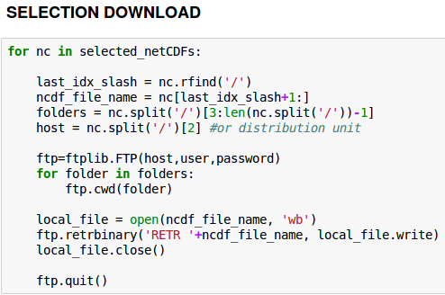
	* [index_file_donwload.ipynb](./PythonNotebooks/indexFileNavigation/index_file_download.ipynb): how to download via ftp index files
	* [index_file_navigation_boundingbox.ipynb](./PythonNotebooks/indexFileNavigation/index_file_navigation_boundingbox.ipynb): how to download via ftp index files and use them to find all platforms contained within a given boundingbox.
	* [index_file_navigation_platformCategory.ipynb](./PythonNotebooks/indexFileNavigation/index_file_navigation_platformCategory.ipynb): how to download via ftp index files and use them to find all platforms of a given category (moorings, drifters, profilers&gliders, etc, vessels).   

- In situ platform locations examples:
	* [IndexFile_Folium_Visalization.ipynb](./PythonNotebooks/IndexFilePlots/IndexFile_Folium_Visalization.ipynb): folium markers.
	* [read_CMEMS_indexfile.ipynb](./PythonNotebooks/IndexFilePlots/read_CMEMS_indexfile.ipynb): latest Mediterranean platforms location.
	* [plot_positions_latest_global.ipynb](./PythonNotebooks/plot_positions_latest_global.ipynb): latest Global platforms location.
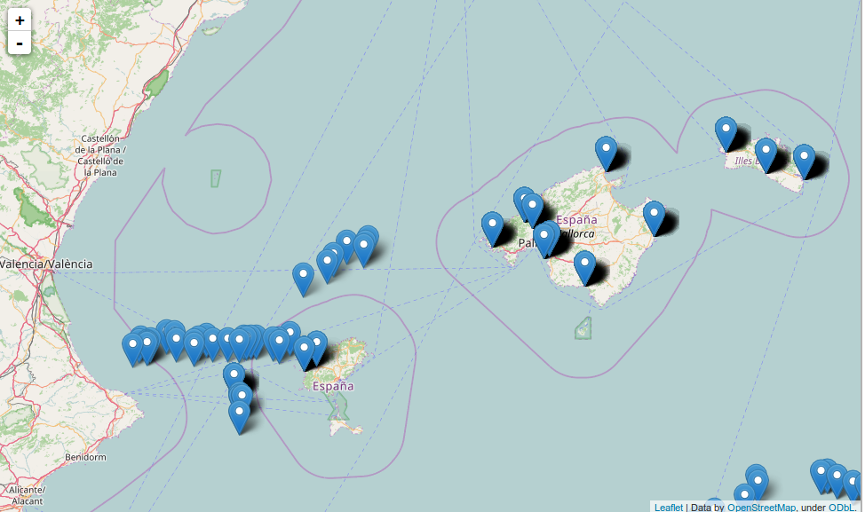
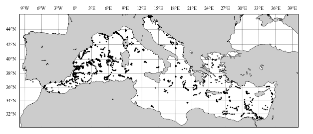
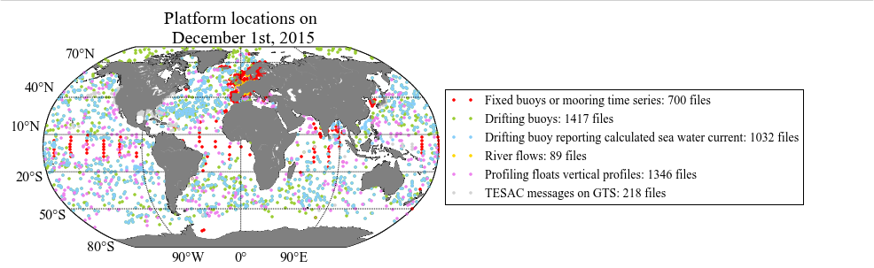

- In situ dataset plots examples:
	* [plot_CMEMS_mooring_NorthWestShelf.ipynb](./PythonNotebooks/PlatformPlots/plot_CMEMS_mooring_NorthWestShelf.ipynb): plots of mooring data
	* [plot_CMEMS_mooring.ipynb](./PythonNotebooks/PlatformPlots/plot_CMEMS_mooring.ipynb): plots of mooring data2
	* [plot_CMEMS_mooring.ipynb](./PythonNotebooks/PlatformPlots/Plot_TimeSeries1.ipynb): plots of mooring data3
	* [plot_CMEMS_vessel.ipynb](./PythonNotebooks/PlatformPlots/plot_CMEMS_vessel.ipynb): plots of vessel data
	* [plot_CMEMS_profiler.ipynb](./PythonNotebooks/PlatformPlots/plot_CMEMS_profiler.ipynb): plots of profilers data
	* [plot_CMEMS_drifter.ipynb](./PythonNotebooks/PlatformPlots/plot_CMEMS_drifter.ipynb): plots of drifters data
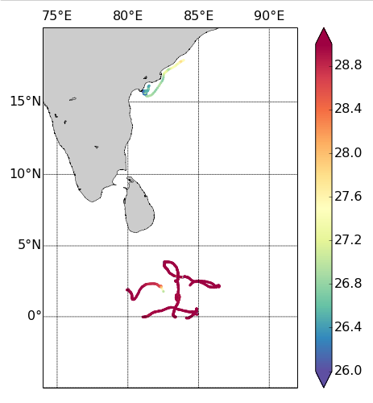
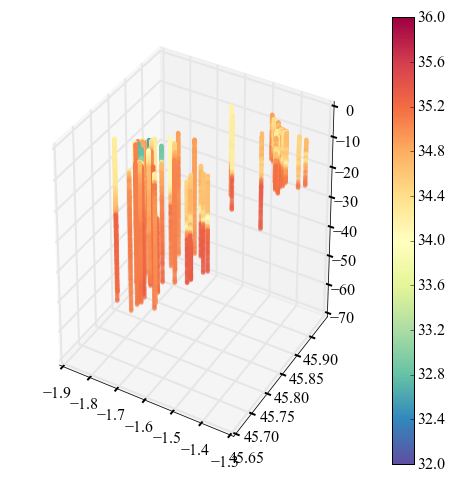
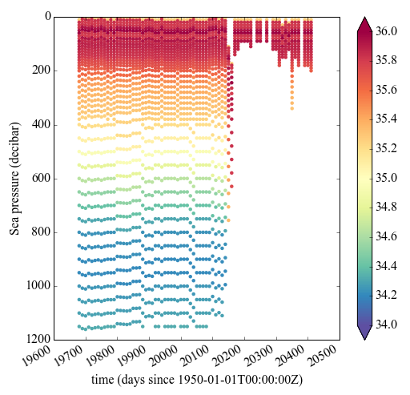
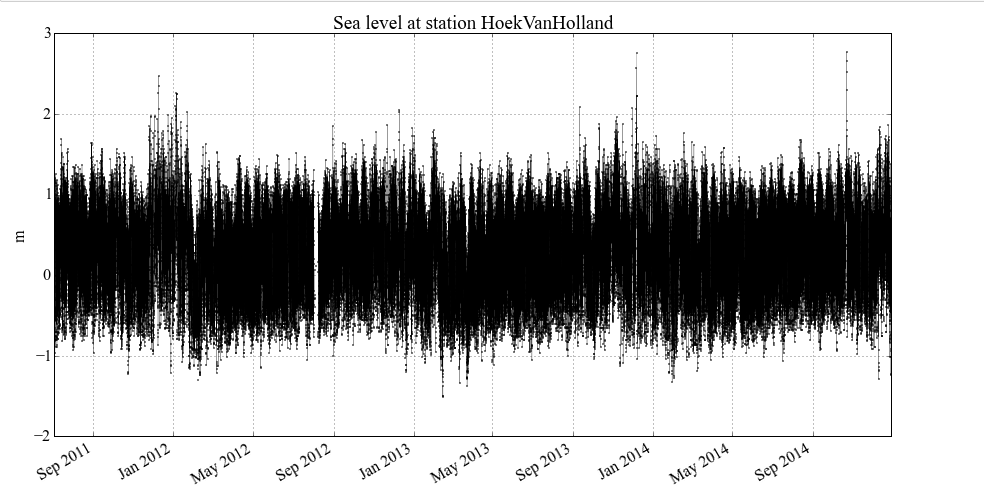
 
 
 
 
 

- In situ dataset processing examples:
	* time series:
		* [Read_TimeSeries_1.ipynb](./PythonNotebooks/PlatformPlots/Read_TimeSeries_1.ipynb): load variables from a local netCDF file.
		* [Read_TimeSeries_2.ipynb](./PythonNotebooks/PlatformPlots/Read_TimeSeries_2.ipynb): load variables from a file available in a [thredds data server](http://www.unidata.ucar.edu/software/thredds/current/tds/)
		* [Read_TimeSeries_3.ipynb](./PythonNotebooks/PlatformPlots/Read_TimeSeries_3.ipynb): use the [cf-module](http://cfpython.bitbucket.org/) to load a variable knowing its [CF standard name](http://cfconventions.org/standard-names.html).
    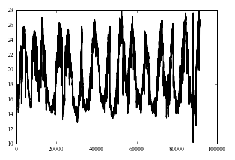
    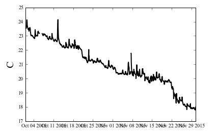
     
     
    
    * trajectories:
        * [Read_drifter_data_1.ipynb](./PythonNotebooks/PlatformPlots/Read_drifter_data_1.ipynb): read a netCDF file containing a surface drifter trajectory.
        * [Read_drifter_data_2.ipynb](./PythonNotebooks/PlatformPlots/Read_drifter_data_2.ipynb): scatter plot using the data from the previous example.
        * [Read_drifter_data_3.ipynb](./PythonNotebooks/PlatformPlots/Read_drifter_data_3.ipynb): creation of a gridded field using the same data.
    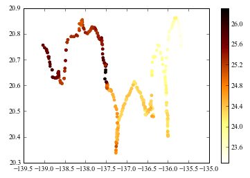
    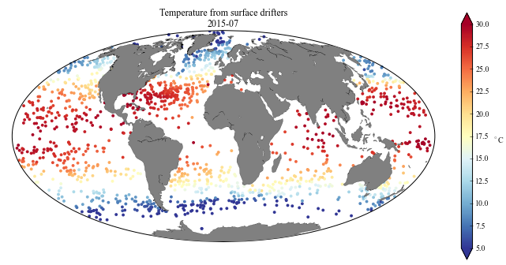
    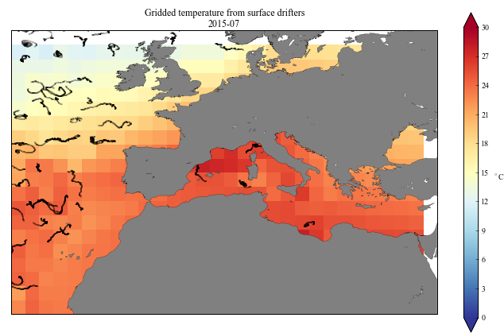
     
     
	* grided data:
		* Salinity from [CORA dataset](./PythonNotebooks/PlatformPlots/Read_CORA_dataset.ipynb)
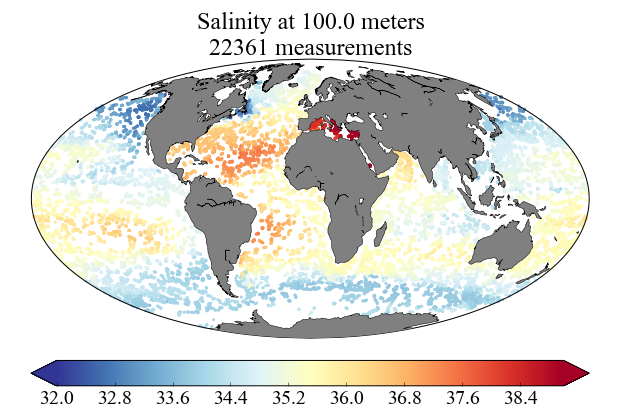      

- In situ WMS - latest directory (work in progress)

## Legacy

This material has been developed by [Charles Troupin](https://github.com/ctroupin), responsible for in situ tac Communication & Training from 2015-2017. 
Minor contributions from [Paz Rotllan](https://github.com/pazrg).